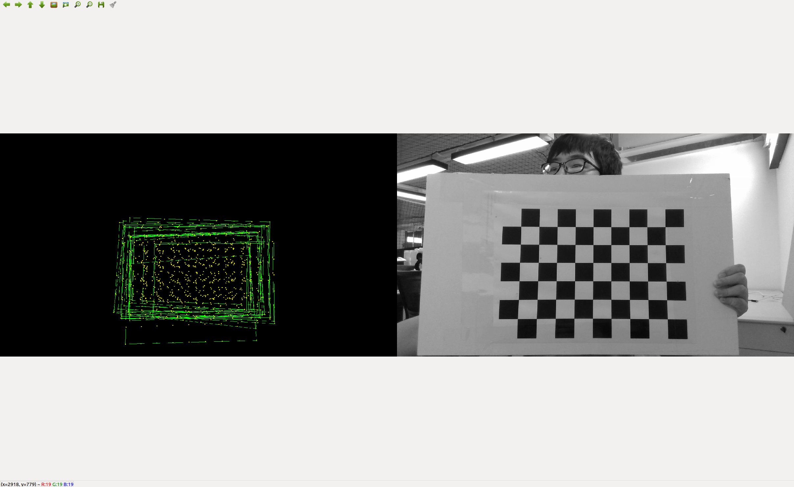
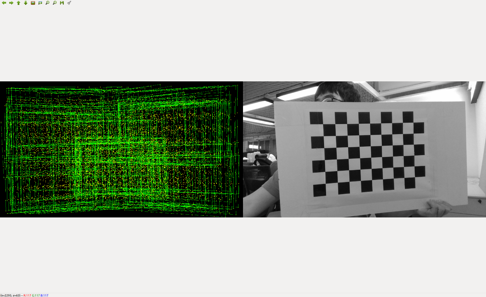

# cam_intrin_calib

This ros package intends to calibrate the intrinsic parameters of the monocular camera. The packages `calib_image_saver` credits to [gaowenliang](https://github.com/gaowenliang) and the `camera_model` credits to [QIN TONG](https://github.com/qintonguav).

Please clone, catkin_make this package and modify the topic names in `single_collect_image.launch` of camera_image_saver package and roslaunch it to collect sufficient images of your checker board.

>image_input is your camera image topic\
image_path is the folder to save the captured images\
board_width and board_height are the number of inner crosspoint of your checker board

Try to cover the full filed with those gree rectangles. Usually we recommend ~300 photos.

Then calibrate the intrinsic parameters with the following instruction, where `-s` is the length of a single square on your checker board in mm.
>rosrun camera_model Calibration -w 9 -h 6 -s 36 -i /home/sam/images -p IMG_ -e .jpg --camera-model pinhole

The calibrated paramters will be saved in `camera_camera_calib.yaml` at your `/home` folder.